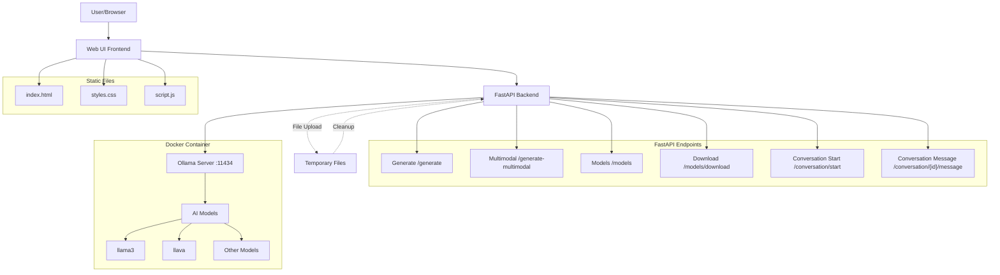

# Local Ollama GUI

A lightweight web application and API built with FastAPI that serves as a frontend and backend interface to an Ollama AI language and multimodal model server. It offers text generation and multimodal (text + image) generation capabilities, along with conversation management, model listing, and model downloading features.

## Features

- **Text Generation:** Generate text completions using specified Ollama models.
- **Multimodal Generation:** Generate responses based on prompts and uploaded images/files.
- **Conversation Management:** Start and maintain multi-turn conversations with message history.
- **Model Management:**
  - List available models from Ollama server.
  - Download new models on demand.
- **Web UI:** Simple, clean web frontend allowing model selection, prompt entry, file upload, and response display.
- **CORS enabled:** Allows cross-origin requests for development purposes.
- **Static file serving:** Serves a static frontend from the `/static` folder.

## Architecture



## Technologies

- **Backend:** FastAPI, Python, Requests
- **Frontend:** HTML, CSS, JavaScript (vanilla)
- **AI Integration:** Communicates with local Ollama API server (`http://localhost:11434`)
- **Serving:** Uvicorn ASGI server
- **Containerization:** Docker (for Ollama server)

## Getting Started

### Prerequisites

- Python 3.8+
- Docker installed and running
- Ollama AI server running locally at port 11434

### Installation

1. Install Python dependencies:
```bash
pip install fastapi uvicorn requests python-multipart
```

### Running the Application

#### Option 1: Using Docker for Ollama (Recommended)

1. Start Docker on your system
2. Run Ollama in a Docker container:
```bash
docker run -d \
  --name ollama \
  -p 11434:11434 \
  -v ollama_volume:/root/.ollama \
  ollama/ollama:latest
```

3. Start the FastAPI server:
```bash
uvicorn main:app --host 0.0.0.0 --port 8000
```

#### Option 2: Using Local Ollama Installation

1. If you have Ollama installed locally, start the Ollama server:
```bash
ollama serve
```

2. Start the FastAPI server:
```bash
uvicorn main:app --host 0.0.0.0 --port 8000
```

3. Visit `http://localhost:8000` in your browser to open the AI Console frontend.

## API Endpoints

### Core Endpoints

- **`GET /`**  
  Serves the main web UI (`index.html`).

- **`POST /generate`**  
  Generate text with a prompt and model. Expects JSON body:
  ```json
  {
    "prompt": "Your text prompt",
    "model": "model_name" // optional, default "llama3"
  }
  ```
  Returns:
  ```json
  {
    "generated_text": "AI generated response"
  }
  ```

- **`POST /generate-multimodal`**  
  Generate multimodal response with prompt, model, and image/file upload (multipart-form).  
  Form Fields: `prompt` (string), `model` (string), `file` (image or supported file).  
  Returns the AI generated text as JSON.

### Model Management

- **`GET /models`**  
  Lists available models from the Ollama API.

- **`POST /models/download`**  
  Download a new model to Ollama server.  
  Body JSON:
  ```json
  {
    "model_name": "name_of_model_to_download"
  }
  ```

### Conversation Management

- **`POST /conversation/start`**  
  Start a new conversation with unique conversation ID.  
  Body JSON:
  ```json
  {
    "conv_id": "your_unique_conversation_id"
  }
  ```

- **`POST /conversation/{conv_id}/message`**  
  Add a message to an existing conversation and get AI reply.  
  Body JSON: same as `/generate`.

- **`GET /conversation/{conv_id}`**  
  Get the entire conversation history (messages).

### Debug

- **`GET /debug/routes`**  
  Debug endpoint that lists all available routes and HTTP methods.

## Frontend Usage

1. Select the AI model from dropdown (models loaded dynamically).
2. Enter text prompt in the textarea.
3. If model supports multimodal input (e.g. `"llama3.2-vision"`, etc.), upload an image or file.
4. Click **Submit** to generate the response.
5. View the AI's generated response below the form.

## Project Structure

```
/
├── main.py                # FastAPI backend server
├── static/
│   ├── index.html         # Frontend HTML page
│   ├── script.js          # Frontend JS logic
│   └── styles.css         # Frontend CSS styles
└── README.md              # This file
```

## Notes and Considerations

- **Docker Requirement:** Docker must be running on your system before starting Ollama.
- **Ollama Server:** The Ollama server must be running (either via Docker or `ollama serve`) before starting the FastAPI application.
- **Static Files:** The app serves static files from the `static` directory. Make sure this folder exists and contains `index.html`, `styles.css`, and `script.js`.
- **Model Support:** The app currently defaults to `"llama3"` if no model is specified.
- **Multimodal Models:** The frontend and backend recognize certain models as multimodal (support image input), e.g., `"llama3.2-vision"`.
- **Temporary Files:** Uploaded images are temporarily saved on disk and deleted after use.
- **CORS:** The backend allows all origins, intended for development only. Adjust CORS settings for production.
- **Error Handling:** The app logs errors and provides HTTP error responses when calls to the Ollama API fail.

## Troubleshooting

- **Port 11434 in use:** Make sure no other Ollama instances are running.
- **Docker not running:** Ensure Docker Desktop is started before running Ollama container.
- **Models not loading:** Check that Ollama server is accessible at `http://localhost:11434`.

## License

```text
MIT License

Copyright (c) 2025 Nicholas McCarty

Permission is hereby granted, free of charge, to any person obtaining a copy  
of this software and associated documentation files (the "Software"), to deal  
in the Software without restriction, including without limitation the rights  
to use, copy, modify, merge, publish, distribute, sublicense, and/or sell  
copies of the Software, and to permit persons to whom the Software is  
furnished to do so, subject to the following conditions:

The above copyright notice and this permission notice shall be included in all  
copies or substantial portions of the Software.

THE SOFTWARE IS PROVIDED "AS IS", WITHOUT WARRANTY OF ANY KIND, EXPRESS OR  
IMPLIED, INCLUDING BUT NOT LIMITED TO THE WARRANTIES OF MERCHANTABILITY,  
FITNESS FOR A PARTICULAR PURPOSE AND NONINFRINGEMENT. IN NO EVENT SHALL THE  
AUTHORS OR COPYRIGHT HOLDERS BE LIABLE FOR ANY CLAIM, DAMAGES OR OTHER  
LIABILITY, WHETHER IN AN ACTION OF CONTRACT, TORT OR OTHERWISE, ARISING FROM,  
OUT OF OR IN CONNECTION WITH THE SOFTWARE OR THE USE OR OTHER DEALINGS IN THE  
SOFTWARE.
```
